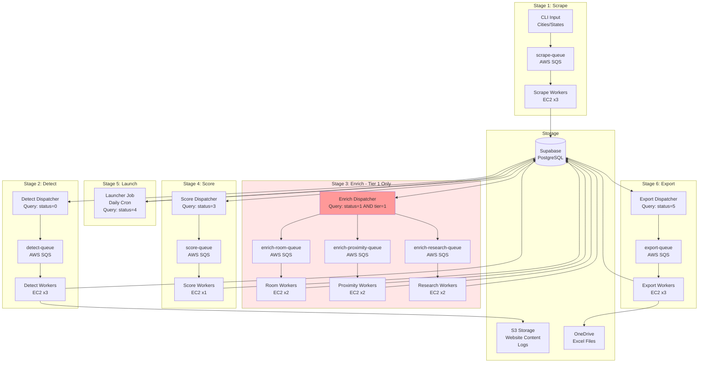

<p align="center">
  
</p>

# Sadie GTM Pipeline

Automated lead generation pipeline for hotel booking engine detection at scale. Refactored to process nationwide with parallel processing and smart filtering.

## Architecture



### Pipeline Overview

This is a 6-stage pipeline using AWS SQS and EC2 consumers that will help us scrape, detect, and enrich the state of Florida, the entire United States, and other countries. The dispatchers only dispatch what we're interested in—the enrichment dispatcher, for example, will only dispatch messages for tier 1 booking engines, reducing the number of hotels for enrichment and hence saving on AI agent costs.

---

## Legacy Single-Script Usage

Lead generation tool for hotel booking engine detection. Scrapes hotels from Google Places API and detects which booking engine they use.

## Setup

```bash
pip install -r requirements.txt
python3 -m playwright install chromium
```

Create `.env` file (for scraper only):
```
GOOGLE_PLACES_API_KEY=your_key_here
```

## Usage

See [commands.md](commands.md) for all commands.

**Quick start:**
```bash
# Scrape hotels in Miami
python3 sadie_scraper.py

# Detect booking engines
python3 sadie_detector.py --input hotels_scraped.csv
```

## Input CSV Format

Minimum required:
```csv
name,website
The Setai Miami Beach,https://www.thesetaihotel.com
Fontainebleau Miami Beach,https://www.fontainebleau.com
```

Optional columns: `phone`, `address`, `latitude`, `longitude`, `rating`, `review_count`, `place_id`

## Output

| File | Description |
|------|-------------|
| `hotels_scraped.csv` | Hotels from Google Places |
| `sadie_leads.csv` | Final output with booking engine data |
| `screenshots/` | Booking page screenshots |

### Output Columns

| Column | Description |
|--------|-------------|
| `name` | Hotel name |
| `website` | Hotel website URL |
| `booking_url` | URL of booking engine page |
| `booking_engine` | Detected engine (SynXis, Cloudbeds, etc.) |
| `booking_engine_domain` | Domain of booking engine |
| `detection_method` | How engine was detected |
| `error` | Error message if any |
| `phone_google` | Phone from Google Places |
| `phone_website` | Phone scraped from website |
| `email` | Email scraped from website |
| `screenshot_path` | Screenshot filename |

## Supported Booking Engines

- Cloudbeds
- Mews
- SynXis / TravelClick
- Little Hotelier
- WebRezPro
- InnRoad
- ResNexus
- Newbook
- RMS Cloud
- RoomRaccoon
- SiteMinder / TheBookingButton
- Sabre / CRS
- eZee

## How Detection Works

1. Load hotel homepage
2. Find and click "Book Now" button
3. Navigate to booking page
4. Sniff network requests for booking engine domains
5. Take screenshot as proof

## Scripts

| Script | Purpose |
|--------|---------|
| `sadie_scraper.py` | Scrape hotels from Google Places API |
| `sadie_detector.py` | Detect booking engines from hotel websites |


## Common Locations

| City | Lat | Lng |
|------|-----|-----|
| Miami | 25.7617 | -80.1918 |
| Los Angeles | 34.0522 | -118.2437 |
| New York | 40.7128 | -74.0060 |
| Las Vegas | 36.1699 | -115.1398 |
| Orlando | 28.5383 | -81.3792 |