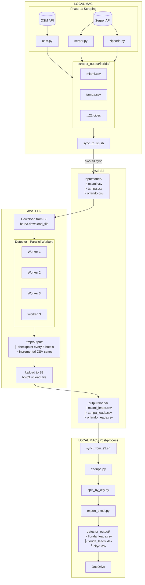
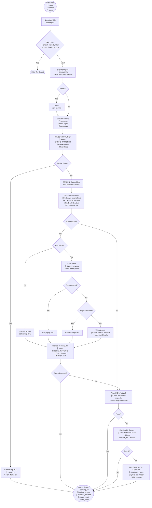
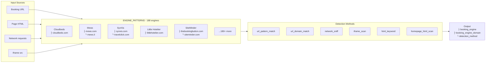
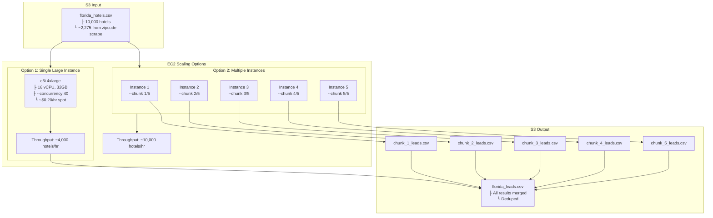
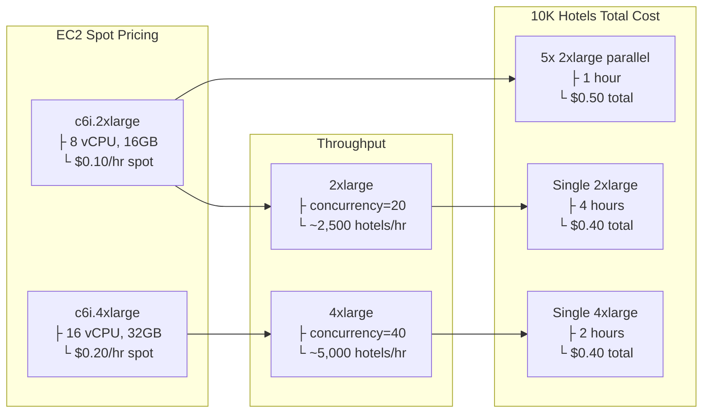
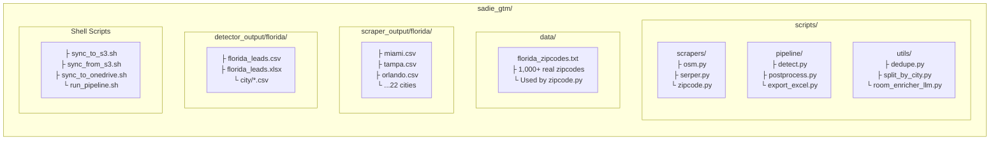

# Sadie Pipeline Architecture

## Complete Flow Diagram

```mermaid
flowchart TB
    subgraph LOCAL["LOCAL MAC"]
        direction TB

        subgraph SCRAPING["Phase 1: Scraping"]
            direction LR
            OSM[("OSM API")]
            SERPER[("Serper API")]

            OSM_SCRIPT["osm.py"]
            SERPER_SCRIPT["serper.py"]
            ZIP_SCRIPT["zipcode.py"]

            OSM --> OSM_SCRIPT
            SERPER --> SERPER_SCRIPT
            SERPER --> ZIP_SCRIPT
        end

        subgraph SCRAPER_OUTPUT["scraper_output/florida/"]
            direction LR
            MIAMI_CSV["miami.csv"]
            TAMPA_CSV["tampa.csv"]
            OTHER_CSV["...22 cities"]
        end

        OSM_SCRIPT --> SCRAPER_OUTPUT
        SERPER_SCRIPT --> SCRAPER_OUTPUT
        ZIP_SCRIPT --> SCRAPER_OUTPUT

        SYNC_UP["sync_to_s3.sh"]
    end

    SCRAPER_OUTPUT --> SYNC_UP

    subgraph S3["AWS S3"]
        direction TB
        S3_INPUT["input/florida/<br>├ miami.csv<br>├ tampa.csv<br>└ orlando.csv"]
        S3_OUTPUT["output/florida/<br>├ miami_leads.csv<br>├ tampa_leads.csv<br>└ orlando_leads.csv"]
    end

    SYNC_UP -->|aws s3 sync| S3_INPUT

    subgraph EC2["AWS EC2"]
        direction TB

        EC2_DOWNLOAD["Download from S3<br>boto3.download_file"]

        subgraph DETECTOR["Detector - Parallel Workers"]
            direction LR
            W1["Worker 1"]
            W2["Worker 2"]
            W3["Worker 3"]
            WN["Worker N"]
        end

        EC2_LOCAL["/tmp/output/<br>├ checkpoint every 5 hotels<br>└ incremental CSV saves"]
        EC2_UPLOAD["Upload to S3<br>boto3.upload_file"]

        EC2_DOWNLOAD --> DETECTOR
        DETECTOR --> EC2_LOCAL
        EC2_LOCAL --> EC2_UPLOAD
    end

    S3_INPUT --> EC2_DOWNLOAD
    EC2_UPLOAD --> S3_OUTPUT

    subgraph LOCAL_POST["LOCAL MAC - Post-process"]
        direction TB

        SYNC_DOWN["sync_from_s3.sh"]
        DEDUPE["dedupe.py"]
        SPLIT["split_by_city.py"]
        EXCEL["export_excel.py"]
        FINAL["detector_output/<br>├ florida_leads.csv<br>├ florida_leads.xlsx<br>└ city/*.csv"]
        ONEDRIVE["OneDrive"]

        SYNC_DOWN --> DEDUPE --> SPLIT --> EXCEL --> FINAL --> ONEDRIVE
    end

    S3_OUTPUT --> SYNC_DOWN
```

## Per-Hotel Detection Flow

```mermaid
flowchart TB
    START([Hotel Input<br>├ name<br>├ website<br>└ phone])

    START --> NORMALIZE["Normalize URL<br>add https://"]

    NORMALIZE --> SKIP_CHECK{"Skip Check<br>├ Chain? marriott, hilton<br>└ Junk? facebook, .gov"}
    SKIP_CHECK -->|Yes| SKIP_END([Skip - No Output])
    SKIP_CHECK -->|Valid| GOTO["playwright.goto<br>├ timeout: 30s<br>└ wait: domcontentloaded"]

    GOTO --> GOTO_FAIL{Timeout?}
    GOTO_FAIL -->|Yes| FALLBACK_GOTO["Retry<br>wait: commit"]
    FALLBACK_GOTO --> EXTRACT
    GOTO_FAIL -->|No| EXTRACT

    EXTRACT["Extract Contacts<br>├ Phone regex<br>├ Email regex<br>└ Room count"]

    EXTRACT --> STAGE0["STAGE 0: HTML Scan<br>├ Search ENGINE_PATTERNS<br>├ Check iframes<br>└ Check hrefs"]

    STAGE0 --> STAGE0_FOUND{Engine Found?}
    STAGE0_FOUND -->|Yes| GET_BOOKING_URL["Get booking URL<br>├ From href<br>└ From iframe src"]
    GET_BOOKING_URL --> DONE
    STAGE0_FOUND -->|No| STAGE1

    STAGE1["STAGE 1: Button Click<br>Find Book Now button"]

    STAGE1 --> FIND_BUTTON["JS Evaluate Priority<br>├ P0: Known engine hrefs<br>├ P1: External domains<br>├ P2: Book Now text<br>└ P3: Reserve text"]

    FIND_BUTTON --> BUTTON_FOUND{Button Found?}
    BUTTON_FOUND -->|No| NETWORK_FALLBACK

    BUTTON_FOUND -->|Yes| HAS_HREF{Has href attr?}
    HAS_HREF -->|Yes| USE_HREF["Use href directly<br>as booking URL"]
    HAS_HREF -->|No| CLICK_BUTTON["Click button<br>├ Capture network<br>└ Wait for response"]

    CLICK_BUTTON --> POPUP{Popup opened?}
    POPUP -->|Yes| POPUP_URL["Get popup URL"]
    POPUP -->|No| NAV_CHECK{Page navigated?}
    NAV_CHECK -->|Yes| NAV_URL["Get new page URL"]
    NAV_CHECK -->|No| WIDGET["Widget mode<br>├ Check network requests<br>└ Look for API calls"]

    USE_HREF --> ANALYZE_URL
    POPUP_URL --> ANALYZE_URL
    NAV_URL --> ANALYZE_URL
    WIDGET --> ANALYZE_URL

    ANALYZE_URL["Analyze Booking URL<br>├ Match ENGINE_PATTERNS<br>├ Check domain<br>└ Network sniff"]

    ANALYZE_URL --> ENGINE_FOUND{Engine Detected?}
    ENGINE_FOUND -->|Yes| DONE
    ENGINE_FOUND -->|No| NETWORK_FALLBACK

    NETWORK_FALLBACK["FALLBACK: Network<br>├ Check homepage requests<br>└ Match engine domains"]

    NETWORK_FALLBACK --> NET_FOUND{Found?}
    NET_FOUND -->|Yes| DONE
    NET_FOUND -->|No| IFRAME_FALLBACK

    IFRAME_FALLBACK["FALLBACK: Iframes<br>├ Scan iframe src URLs<br>└ Match ENGINE_PATTERNS"]

    IFRAME_FALLBACK --> IFRAME_FOUND{Found?}
    IFRAME_FOUND -->|Yes| DONE
    IFRAME_FOUND -->|No| HTML_FALLBACK

    HTML_FALLBACK["FALLBACK: HTML Keywords<br>├ cloudbeds, mews<br>├ synxis, siteminder<br>└ 180+ patterns"]

    HTML_FALLBACK --> DONE

    DONE([Output Result<br>├ booking_url<br>├ booking_engine<br>├ detection_method<br>├ phone, email<br>└ room_count])
```

## Engine Detection Patterns

```mermaid
flowchart LR
    subgraph INPUT["Input Sources"]
        URL["Booking URL"]
        HTML["Page HTML"]
        NET["Network requests"]
        IFRAME["Iframe src"]
    end

    subgraph PATTERNS["ENGINE_PATTERNS - 188 engines"]
        direction TB
        P1["Cloudbeds<br>├ cloudbeds.com"]
        P2["Mews<br>├ mews.com<br>└ mews.li"]
        P3["SynXis<br>├ synxis.com<br>└ travelclick.com"]
        P4["Little Hotelier<br>├ littlehotelier.com"]
        P5["SiteMinder<br>├ thebookingbutton.com<br>└ siteminder.com"]
        P6["...180+ more"]
    end

    subgraph METHODS["Detection Methods"]
        M1["url_pattern_match"]
        M2["url_domain_match"]
        M3["network_sniff"]
        M4["iframe_scan"]
        M5["html_keyword"]
        M6["homepage_html_scan"]
    end

    URL --> PATTERNS
    HTML --> PATTERNS
    NET --> PATTERNS
    IFRAME --> PATTERNS

    PATTERNS --> METHODS

    METHODS --> OUTPUT["Output<br>├ booking_engine<br>├ booking_engine_domain<br>└ detection_method"]
```

## Parallel Scaling on EC2

```mermaid
flowchart TB
    subgraph S3_IN["S3 Input"]
        INPUT["florida_hotels.csv<br>├ 10,000 hotels<br>└ ~2,275 from zipcode scrape"]
    end

    subgraph EC2_CLUSTER["EC2 Scaling Options"]
        direction TB

        subgraph OPT1["Option 1: Single Large Instance"]
            SINGLE["c6i.4xlarge<br>├ 16 vCPU, 32GB<br>├ --concurrency 40<br>└ ~$0.20/hr spot"]
            SINGLE_RATE["Throughput: ~4,000 hotels/hr"]
            SINGLE --> SINGLE_RATE
        end

        subgraph OPT2["Option 2: Multiple Instances"]
            direction LR
            I1["Instance 1<br>--chunk 1/5"]
            I2["Instance 2<br>--chunk 2/5"]
            I3["Instance 3<br>--chunk 3/5"]
            I4["Instance 4<br>--chunk 4/5"]
            I5["Instance 5<br>--chunk 5/5"]
        end
        MULTI_RATE["Throughput: ~10,000 hotels/hr"]
        OPT2 --> MULTI_RATE
    end

    INPUT --> OPT1
    INPUT --> OPT2

    subgraph S3_OUT["S3 Output"]
        OUT1["chunk_1_leads.csv"]
        OUT2["chunk_2_leads.csv"]
        OUT3["chunk_3_leads.csv"]
        OUT4["chunk_4_leads.csv"]
        OUT5["chunk_5_leads.csv"]
        MERGED["florida_leads.csv<br>├ All results merged<br>└ Deduped"]
    end

    SINGLE_RATE --> MERGED
    I1 --> OUT1 --> MERGED
    I2 --> OUT2 --> MERGED
    I3 --> OUT3 --> MERGED
    I4 --> OUT4 --> MERGED
    I5 --> OUT5 --> MERGED
```

## Cost Estimate

```mermaid
flowchart LR
    subgraph COST["EC2 Spot Pricing"]
        C1["c6i.2xlarge<br>├ 8 vCPU, 16GB<br>└ $0.10/hr spot"]
        C2["c6i.4xlarge<br>├ 16 vCPU, 32GB<br>└ $0.20/hr spot"]
    end

    subgraph THROUGHPUT["Throughput"]
        T1["2xlarge<br>├ concurrency=20<br>└ ~2,500 hotels/hr"]
        T2["4xlarge<br>├ concurrency=40<br>└ ~5,000 hotels/hr"]
    end

    subgraph TOTAL["10K Hotels Total Cost"]
        TOT1["Single 2xlarge<br>├ 4 hours<br>└ $0.40 total"]
        TOT2["Single 4xlarge<br>├ 2 hours<br>└ $0.40 total"]
        TOT3["5x 2xlarge parallel<br>├ 1 hour<br>└ $0.50 total"]
    end

    C1 --> T1 --> TOT1
    C2 --> T2 --> TOT2
    C1 --> TOT3
```

## File Structure

```mermaid
flowchart TB
    subgraph PROJECT["sadie_gtm/"]
        direction TB

        subgraph SCRIPTS["scripts/"]
            direction TB
            SCRAPERS["scrapers/<br>├ osm.py<br>├ serper.py<br>└ zipcode.py"]
            PIPELINE["pipeline/<br>├ detect.py<br>├ postprocess.py<br>└ export_excel.py"]
            UTILS["utils/<br>├ dedupe.py<br>├ split_by_city.py<br>└ room_enricher_llm.py"]
        end

        subgraph DATA["data/"]
            ZIPCODES["florida_zipcodes.txt<br>├ 1,000+ real zipcodes<br>└ Used by zipcode.py"]
        end

        subgraph SCRAPER_OUT["scraper_output/florida/"]
            S_FILES["├ miami.csv<br>├ tampa.csv<br>├ orlando.csv<br>└ ...22 cities"]
        end

        subgraph DETECTOR_OUT["detector_output/florida/"]
            D_FILES["├ florida_leads.csv<br>├ florida_leads.xlsx<br>└ city/*.csv"]
        end

        subgraph SHELL["Shell Scripts"]
            SH_FILES["├ sync_to_s3.sh<br>├ sync_from_s3.sh<br>├ sync_to_onedrive.sh<br>└ run_pipeline.sh"]
        end
    end
```
