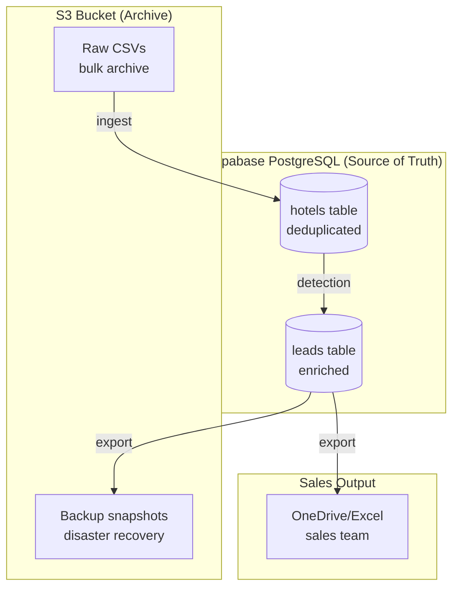
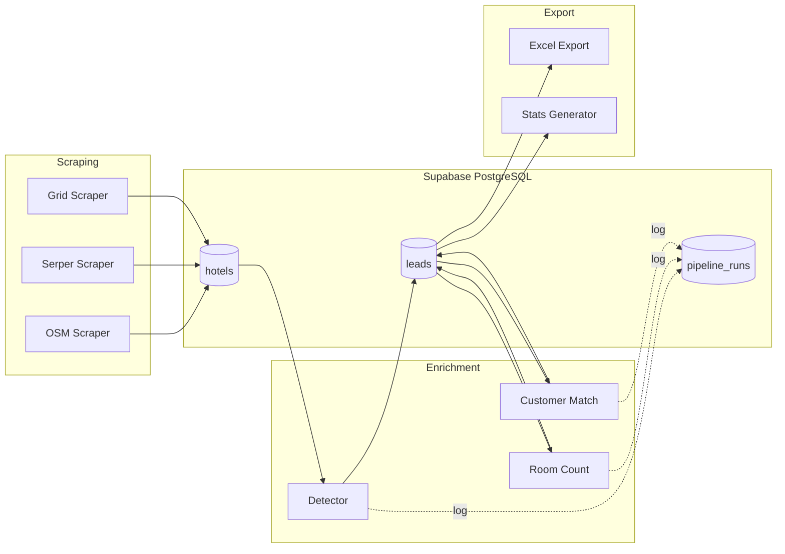

# Sadie GTM Refactor Plan

## Overview

Migrate from CSV-based data management to Supabase PostgreSQL for better data integrity, deduplication, and pipeline tracking.

## Current State (CSV-based)

```
scraper_output/          → Raw hotel data from OSM/Serper/Grid scrapers
detector_output/         → Leads with booking engine detection
OneDrive/               → Excel exports for sales team
```

**Problems:**
- 4,438 duplicates discovered in Florida alone (8,157 → 3,719 unique)
- No transaction safety - pipeline failures can corrupt data
- Manual deduplication required at export time
- No way to track pipeline runs or enrichment status
- Difficult to query across cities/states
- S3 sync disasters can overwrite good data with stale data

## Phase 1: Supabase PostgreSQL

### Why Supabase?

| Benefit | Description |
|---------|-------------|
| **Managed PostgreSQL** | No server maintenance, automatic backups, point-in-time recovery |
| **Deduplication at insert** | `ON CONFLICT` clauses prevent duplicates at write time |
| **Pipeline state tracking** | Know exactly which hotels were processed, when, and by which step |
| **SQL analytics** | Query across all states/cities instantly |
| **Real-time subscriptions** | Live dashboards for pipeline monitoring |
| **REST API** | Auto-generated API for future integrations |
| **Row-level security** | Fine-grained access control if needed |
| **Free tier** | 500MB database, 1GB file storage - enough for MVP |

### Schema Design

```sql
-- Core tables
hotels          -- Raw scraped data (source of truth)
leads           -- Enriched leads with booking engine info
pipeline_runs   -- Track each pipeline execution
booking_engines -- Reference table for tier classification

-- Key constraints
UNIQUE (website) ON leads     -- Dedupe by website
UNIQUE (place_id) ON hotels   -- Dedupe by Google Place ID
```

### Relationship with S3



**S3 Role:**
- **Bulk archive**: Store raw scraper CSVs for audit trail
- **Disaster recovery**: Daily PostgreSQL dumps to S3
- **Large file storage**: Supabase Storage (S3-compatible) for Excel exports

**PostgreSQL Role:**
- **Source of truth**: All active data lives here
- **Deduplication**: Enforced at database level
- **State management**: Track what's processed vs pending
- **Analytics**: Fast queries for stats and reporting

### Benefits Over Current CSV Approach

| Scenario | CSV (Current) | PostgreSQL (New) |
|----------|---------------|------------------|
| Pipeline crash mid-run | Partial data, manual recovery | Transaction rollback, clean state |
| Find duplicates | `sort \| uniq` on export | Never inserted (UNIQUE constraint) |
| "How many Miami leads?" | `wc -l detector_output/florida/miami_leads.csv` | `SELECT COUNT(*) FROM leads WHERE city='Miami'` |
| "Which leads need room count?" | Scan all files | `SELECT * FROM leads WHERE room_count IS NULL` |
| Re-run enrichment | Process all files again | `UPDATE leads SET status='pending' WHERE ...` |
| S3 sync overwrites data | Data loss | Database unaffected, re-sync from DB |

## Phase 2: Pipeline Refactor (Future)

- Replace CSV read/write with PostgreSQL queries
- Add `pipeline_runs` table to track each execution
- Implement proper retry logic with database state
- Add Supabase Edge Functions for webhooks/alerts

### Target Pipeline Architecture



## Migration Steps

1. **Create Supabase project** and configure connection
2. **Run schema migration** (`db/schema.sql`)
3. **Ingest existing data** (`db/ingest.py`)
4. **Validate counts match** CSV totals
5. **Update pipeline scripts** to write to PostgreSQL
6. **Keep CSV export** as backup for first 2 weeks
7. **Deprecate CSV** once stable

## Costs

| Tier | Database | Storage | Price |
|------|----------|---------|-------|
| Free | 500MB | 1GB | $0/mo |
| Pro | 8GB | 100GB | $25/mo |

Current data size estimate: ~50MB (easily fits free tier)
