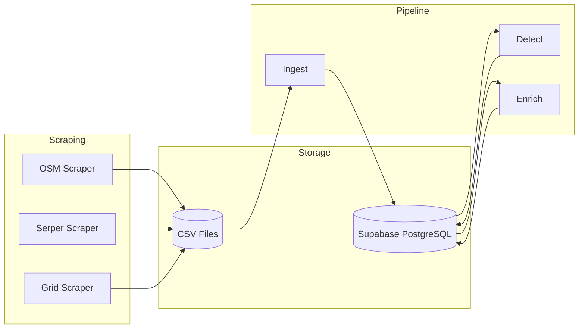
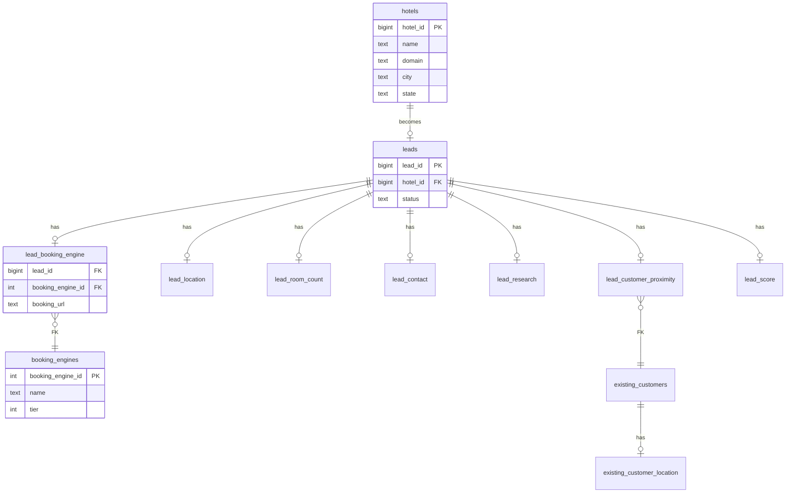
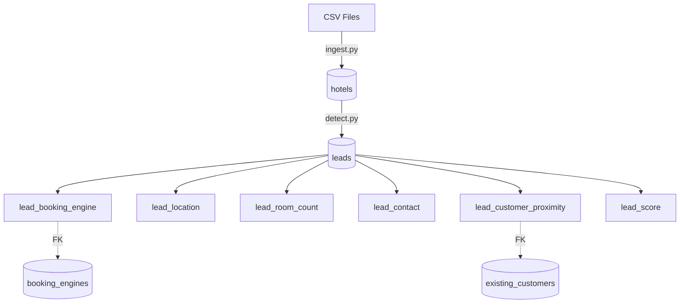
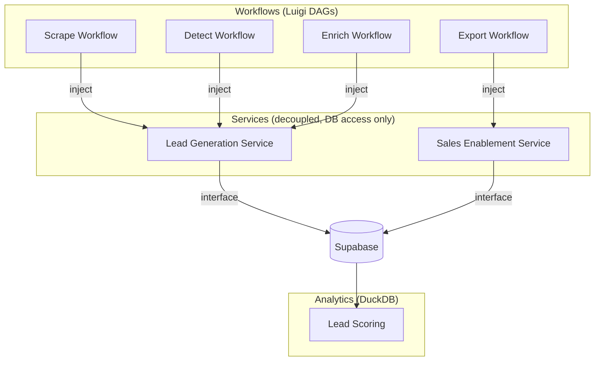

# Sadie GTM Database Schema

## Architecture



---

## Data Model



---

## Tables Overview

| Table | Purpose |
|-------|---------|
| `hotels` | Raw scraped data (source of truth) |
| `leads` | Hotels that passed detection |
| `lead_booking_engine` | FK to booking_engines reference |
| `lead_location` | Enriched lat/long coordinates |
| `lead_room_count` | Room count + source + confidence |
| `lead_contact` | Phone, email (normalized) |
| `lead_research` | AI agent research (JSONB) |
| `lead_customer_proximity` | FK to nearest existing customer |
| `lead_score` | Scoring and prioritization |
| `booking_engines` | Reference: known engines + tier |
| `existing_customers` | Sadie customers |
| `existing_customer_location` | Customer coordinates |
| `pipeline_runs` | Execution tracking |

---

## Lead Extension Tables

```
leads
    ├── lead_booking_engine       → FK to booking_engines
    ├── lead_location             → lat/long + source
    ├── lead_room_count           → count + source + confidence
    ├── lead_contact              → phone, email
    ├── lead_research             → AI research (JSONB)
    ├── lead_customer_proximity   → FK to existing_customers
    └── lead_score                → scoring (0-100)
```

---

## Key Design Decisions

| Decision | Choice | Rationale |
|----------|--------|-----------|
| Dedupe hotels | `UNIQUE(name, domain)` | Same name + domain = same hotel |
| Dedupe leads | `UNIQUE(hotel_id)` | One lead per hotel |
| Booking engine | FK to reference table | Consistent tier classification |
| Location | Separate table | Independent enrichment, source tracking |
| Research | JSONB | Flexible AI output, multiple types |
| Coordinates | Copied to lead_location | Leads self-contained, no join to hotels |

---

## Data Flow



---

## Costs

| Item | Cost |
|------|------|
| Supabase Free Tier | $0 (500MB DB, 1GB storage) |
| Scraping (Serper) | Already paid during scrape |
| Geocoding missing leads | ~$0.19 for 186 leads |
| Re-geocoding | Optional, ~$0.001/lead |

---

## Migration Plan

1. Create Supabase project
2. Run `schema.sql`
3. Build `ingest.py` to load CSVs → hotels
4. Update `detect.py` to write → leads + lead_booking_engine
5. Update enrichers to write → lead_* tables
6. Keep CSV backup for 2 weeks
7. Deprecate CSV workflow

---

## Code Architecture



### Services

- **Completely decoupled** - no intercommunication between services
- Each service has its own repo(s)
- **Interface** - functions that can be used externally by workflows or APIs
- **Only way to access DB** is through a service function

### Workflows

- Tasks/jobs that **dependency inject** the service
- Simple orchestration, outsource work to service
- **Luigi** for task dependencies and DAGs

### Producers

- Each producer has a **dataloader**
- DAG organizes running multiple producers
- Scheduled or triggered

### Analytics

- **DuckDB** for analytics jobs (lead scoring, etc.)
- Last feature to build
