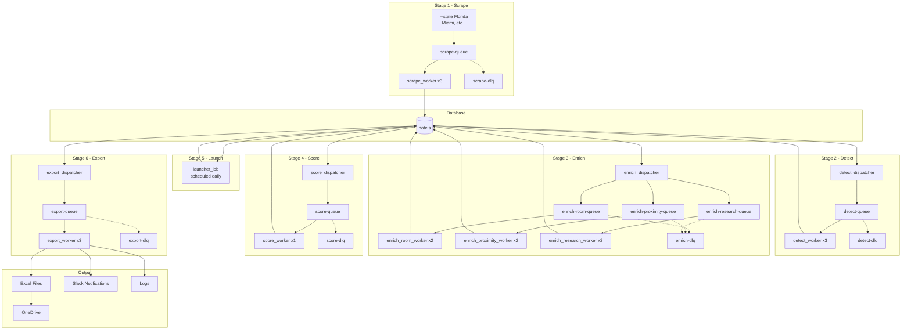

## Queues

| Queue | Message | Producer | Consumer | Workers |
|-------|---------|----------|----------|---------|
| scrape-queue | `{city, state, scraper}` | CLI | scrape_worker | 3 |
| detect-queue | `{hotel_id}` | detect_dispatcher | detect_worker | 3 |
| enrich-room-queue | `{hotel_id}` | enrich_dispatcher | enrich_room_worker | 2 |
| enrich-proximity-queue | `{hotel_id}` | enrich_dispatcher | enrich_proximity_worker | 2 |
| enrich-research-queue | `{hotel_id}` | enrich_dispatcher | enrich_research_worker | 2 |
| score-queue | `{hotel_id}` | score_dispatcher | score_worker | 1 |
| export-queue | `{city, state, type}` | export_dispatcher | export_worker | 3 |

## Dead Letter Queues

| DLQ | Source | Retry Policy |
|-----|--------|--------------|
| scrape-dlq | scrape-queue | 3 retries, then DLQ |
| detect-dlq | detect-queue | 3 retries, then DLQ |
| enrich-dlq | enrich-room/proximity/research queues | 3 retries, then DLQ |
| score-dlq | score-queue | 3 retries, then DLQ |
| export-dlq | export-queue | 3 retries, then DLQ |

## Dispatchers & Jobs

| Name | Type | Polls For | Pushes To |
|------|------|-----------|-----------|
| detect_dispatcher | Dispatcher | Hotels with `status = 0` (scraped) | detect-queue |
| enrich_dispatcher | Dispatcher | Hotels with `status = 1` (detected) AND `booking_engines.tier = 1` | enrich-room-queue, enrich-proximity-queue, enrich-research-queue (parallel) |
| score_dispatcher | Dispatcher | Hotels where all 3 enrichment jobs complete (status = 3) | score-queue |
| launcher_job | Scheduled Job | Hotels with `status = 4` (scored) + passing criteria | Updates `status = 5` (live) in DB |
| export_dispatcher | Dispatcher | Hotels with `status = 5` (live) | export-queue (per city + state aggregate) |

## Message Schemas

**scrape-queue:**
```json
{
  "city": "Miami",
  "state": "Florida",
  "scraper": "city"
}
```

**detect/enrich/score queues:**
```json
{
  "hotel_id": 123
}
```

**export-queue:**
```json
{
  "city": "Miami",
  "state": "Florida",
  "type": "city"
}
```
or
```json
{
  "state": "Florida",
  "type": "state"
}
```

## Worker Scaling

| Stage | Rate Limit | Suggested Workers | Notes |
|-------|------------|-------------------|-------|
| Scrape | Serper: 100/min | 3 | |
| Detect | Playwright: ~10/min per worker | 3 | |
| Enrich Room | Groq: 30/min | 2 | |
| Enrich Proximity | DB only | 2 | |
| Enrich Research | Claude: 50/min | 2 | |
| Score | DB only | 1 | |
| Launch | Scheduled daily | 1 | Runs as cron job, not queue-based |
| Export | OneDrive API | 3 | Generates city + state Excel files |

## Pipeline Flow

### Stage 1: Scrape
**CLI submits cities/states** → scrape_workers fetch hotel data from Serper → write to `hotels` table with `status=0` (scraped)

### Stage 2: Detect (Sequential - must complete before enrichment)
**detect_dispatcher** polls for hotels with `status=0` → sends `{hotel_id}` to detect-queue → **detect_workers** analyze website for booking engines:

**Process:**
1. Fetch hotel website HTML
2. Strip HTML to plain text and truncate to ~50KB
3. Upload to S3: `s3://sadie-gtm-data/website-content/{state}/{city}/{hotel_id}.txt`
4. Analyze for booking engine detection
5. If booking engine found:
   - `INSERT INTO hotel_booking_engines` with `booking_engine_id`, `booking_url`, `detection_method`
   - `UPDATE hotels SET status=1, website_content_s3_path='s3://...'` (detected)
6. If no booking engine: `UPDATE hotels SET status=99, website_content_s3_path='s3://...'` (no_booking_engine - dead end)

**Tier is determined by `booking_engines` table:**
- `tier = 1`: Premium booking engines (will be enriched)
- `tier = 2`: Lower priority engines (skip enrichment, go straight to scoring)

### Stage 3: Enrich (3 parallel jobs - TIER 1 ONLY)
**enrich_dispatcher** polls for:
```sql
SELECT h.id FROM hotels h
INNER JOIN hotel_booking_engines hbe ON h.id = hbe.hotel_id
INNER JOIN booking_engines be ON hbe.booking_engine_id = be.id
WHERE h.status = 1 AND be.tier = 1
```

Fans out to 3 queues simultaneously:
- **enrich-room-queue**: Get room count (Groq/regex)
- **enrich-proximity-queue**: Calculate proximity to attractions (DB/maps)
- **enrich-research-queue**: Additional research (Claude)

All 3 workers write enrichment data back to the same hotel record. When all 3 jobs complete → `status=3` (enriched)

**Tier 2 hotels skip enrichment** and go straight to scoring with limited data.

### Stage 4: Score
**score_dispatcher** polls for hotels where all 3 enrichment jobs complete (`status=3`) or tier 2 hotels (`status=1` + `tier=2`) → **score_workers** calculate lead quality score (0-100) based on:
- Booking engine tier
- Room count (if enriched)
- Rating/reviews
- Location quality
- Enrichment data completeness

Updates hotel with `score` + `score_details` → `status=4` (scored)

### Stage 5: Launch (Marking Hotels Live)
The **launcher_job** runs on a **daily schedule** (cron):
- Queries DB for hotels with `status=4` (scored)
- Checks if each hotel meets quality criteria (score threshold, required fields, tier 1, etc.)
- Marks qualified hotels as `status=5` (live)
- Logs which hotels were launched vs. rejected

**Why scheduled?** With thousands of hotels across the US, you want human-in-the-loop review timing:
- Run once per day (e.g., 6am)
- Review dashboard before launch if needed
- Batch processing is more efficient than real-time

### Stage 6: Export (Excel Generation)
The **export_dispatcher** polls for hotels with `status=5` (live) and creates export jobs:
- **City exports**: One message per city (e.g., `{city: "Miami", state: "Florida", type: "city"}`)
- **State exports**: One message per state (e.g., `{state: "Florida", type: "state"}`)

**Why use a queue?**
- **Scale**: Thousands of cities/files across 50 states
- **Parallel processing**: 3 workers generate Excel files simultaneously
- **Independent retry**: If Miami.xlsx fails to upload, retry just that file
- **Progress tracking**: See which cities/states are complete

Each export_worker:
1. Queries DB for live hotels (filtered by city or entire state)
2. Generates Excel file with hotel data (joins with `hotel_booking_engines` for booking engine info)
3. Uploads to OneDrive (organized by state/city)
4. Sends Slack notification
5. Marks hotels as `status=6` (exported)

## Logging Strategy

**Hybrid Approach: Database (PostgreSQL) + S3**

### Database Logs (Fast, Queryable)
- **audit_log table**: All status transitions (scraped → detected → enriched → scored → live → exported)
- **jobs table**: Individual job executions with metrics (duration, success/failure, worker_id)
- **pipeline_runs table**: High-level pipeline execution summaries
- **Retention**: 90 days (then archive to S3)
- **Use cases**: Dashboards, monitoring, "what's the status of hotel X?"

### S3 Storage (Long-term, Detailed)
- **Website content**: Stripped HTML from hotel websites (truncated to ~50KB) - saved during detection
- **Application logs**: Worker stdout/stderr, debug output
- **Error details**: Full stack traces for debugging
- **API responses**: Raw Claude/Groq/Serper outputs for audit
- **Retention**: 1 year
- **Structure**:
  - Website content: `s3://sadie-gtm-data/website-content/{state}/{city}/{hotel_id}.txt`
  - Logs: `s3://sadie-gtm-data/{workers,jobs,runs,api-responses}/{job_type}/{date}/{id}.log`

### Worker Logging Workflow
1. Job starts → `INSERT INTO jobs` with `status=1` (running)
2. Detect worker: Fetches website, strips HTML, uploads to S3 (website-content), updates `website_content_s3_path`
3. Worker streams logs to S3 → Updates `s3_log_path`
4. Job completes → `UPDATE jobs` with `status=2` (completed), `duration_ms`
5. Status change → Trigger automatically creates `audit_log` entry
6. On error → Stores `error_message` + `error_stack` in DB with `status=3` (failed), full logs in S3

**Why hybrid?**
- DB for real-time monitoring and metrics
- S3 for debugging, compliance, and long-term storage
- Each worker references its S3 logs via `s3_log_path` field
