# Palm Beach Scraper Results

---

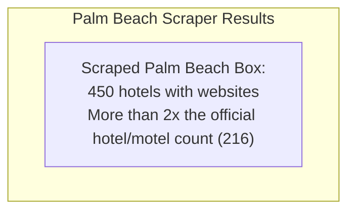
```mermaid
flowchart TB
    subgraph TITLE["Palm Beach Scraper Results"]
        FACT["Scraped Palm Beach Box:<br/>450 hotels with websites<br/>More than 2x the official hotel/motel count (216)"]
    end
```

---

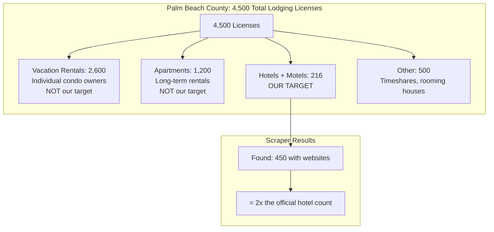
```mermaid
flowchart TD
    subgraph PB["Palm Beach County: 4,500 Total Lodging Licenses"]
        TOTAL["4,500 Licenses"]

        TOTAL --> VR["Vacation Rentals: 2,600<br/>Individual condo owners<br/>NOT our target"]
        TOTAL --> APT["Apartments: 1,200<br/>Long-term rentals<br/>NOT our target"]
        TOTAL --> HM["Hotels + Motels: 216<br/>OUR TARGET"]
        TOTAL --> OTHER["Other: 500<br/>Timeshares, rooming houses"]
    end

    subgraph SCRAPER["Scraper Results"]
        FOUND["Found: 450 with websites"]
        COVERAGE["= 2x the official hotel count"]
        FOUND --> COVERAGE
    end

    HM --> FOUND
```

---

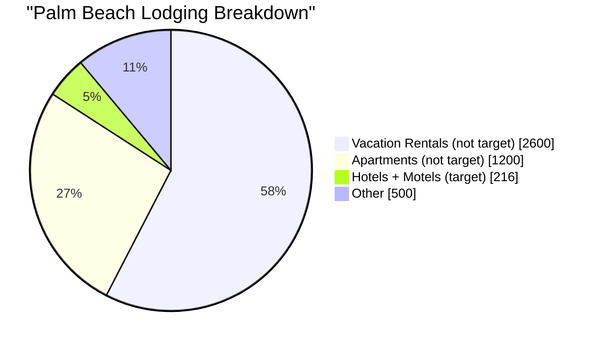
```mermaid
pie showData
    title "Palm Beach Lodging Breakdown"
    "Vacation Rentals (not target)" : 2600
    "Apartments (not target)" : 1200
    "Hotels + Motels (target)" : 216
    "Other" : 500
```

---

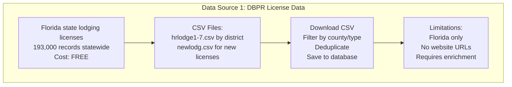
```mermaid
flowchart TB
    subgraph DS["Data Source 1: DBPR License Data"]
        INFO1["Florida state lodging licenses<br/>193,000 records statewide<br/>Cost: FREE"]

        FILES["CSV Files:<br/>hrlodge1-7.csv by district<br/>newlodg.csv for new licenses"]

        PROCESS1["Download CSV<br/>Filter by county/type<br/>Deduplicate<br/>Save to database"]

        LIMITS1["Limitations:<br/>Florida only<br/>No website URLs<br/>Requires enrichment"]

        INFO1 --> FILES
        FILES --> PROCESS1
        PROCESS1 --> LIMITS1
    end
```

---

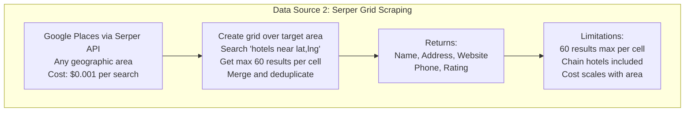
```mermaid
flowchart TB
    subgraph DS2["Data Source 2: Serper Grid Scraping"]
        INFO2["Google Places via Serper API<br/>Any geographic area<br/>Cost: $0.001 per search"]

        PROCESS2["Create grid over target area<br/>Search 'hotels near lat,lng'<br/>Get max 60 results per cell<br/>Merge and deduplicate"]

        OUTPUT2["Returns:<br/>Name, Address, Website<br/>Phone, Rating"]

        LIMITS2["Limitations:<br/>60 results max per cell<br/>Chain hotels included<br/>Cost scales with area"]

        INFO2 --> PROCESS2
        PROCESS2 --> OUTPUT2
        OUTPUT2 --> LIMITS2
    end
```

---

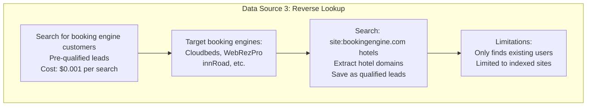
```mermaid
flowchart TB
    subgraph DS3["Data Source 3: Reverse Lookup"]
        INFO3["Search for booking engine customers<br/>Pre-qualified leads<br/>Cost: $0.001 per search"]

        TARGETS["Target booking engines:<br/>Cloudbeds, WebRezPro<br/>innRoad, etc."]

        PROCESS3["Search: site:bookingengine.com hotels<br/>Extract hotel domains<br/>Save as qualified leads"]

        LIMITS3["Limitations:<br/>Only finds existing users<br/>Limited to indexed sites"]

        INFO3 --> TARGETS
        TARGETS --> PROCESS3
        PROCESS3 --> LIMITS3
    end
```

---

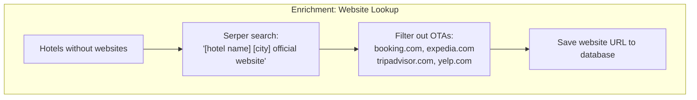
```mermaid
flowchart TD
    subgraph ENRICH["Enrichment: Website Lookup"]
        INPUT1["Hotels without websites"]

        SEARCH1["Serper search:<br/>'[hotel name] [city] official website'"]

        FILTER1["Filter out OTAs:<br/>booking.com, expedia.com<br/>tripadvisor.com, yelp.com"]

        SAVE1["Save website URL to database"]

        INPUT1 --> SEARCH1
        SEARCH1 --> FILTER1
        FILTER1 --> SAVE1
    end
```

---

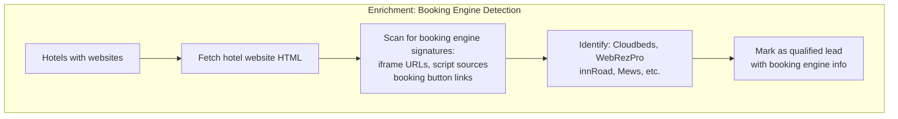
```mermaid
flowchart TD
    subgraph DETECT["Enrichment: Booking Engine Detection"]
        INPUT2["Hotels with websites"]

        FETCH["Fetch hotel website HTML"]

        SCAN["Scan for booking engine signatures:<br/>iframe URLs, script sources<br/>booking button links"]

        IDENTIFY["Identify: Cloudbeds, WebRezPro<br/>innRoad, Mews, etc."]

        QUALIFIED["Mark as qualified lead<br/>with booking engine info"]

        INPUT2 --> FETCH
        FETCH --> SCAN
        SCAN --> IDENTIFY
        IDENTIFY --> QUALIFIED
    end
```

---

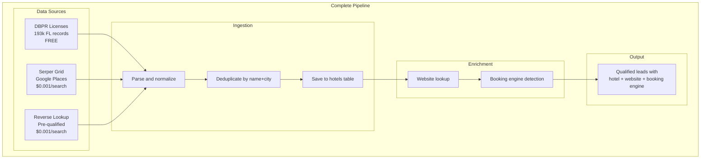
```mermaid
flowchart TB
    subgraph PIPELINE["Complete Pipeline"]
        subgraph SOURCES["Data Sources"]
            S1["DBPR Licenses<br/>193k FL records<br/>FREE"]
            S2["Serper Grid<br/>Google Places<br/>$0.001/search"]
            S3["Reverse Lookup<br/>Pre-qualified<br/>$0.001/search"]
        end

        subgraph INGEST["Ingestion"]
            I1["Parse and normalize"]
            I2["Deduplicate by name+city"]
            I3["Save to hotels table"]
        end

        subgraph ENRICHMENT["Enrichment"]
            E1["Website lookup"]
            E2["Booking engine detection"]
        end

        subgraph OUTPUT["Output"]
            O1["Qualified leads with<br/>hotel + website + booking engine"]
        end

        S1 --> I1
        S2 --> I1
        S3 --> I1
        I1 --> I2
        I2 --> I3
        I3 --> E1
        E1 --> E2
        E2 --> O1
    end
```

---

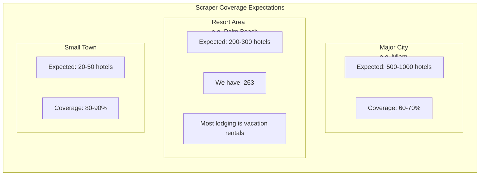
```mermaid
flowchart LR
    subgraph EXPECT["Scraper Coverage Expectations"]
        subgraph MAJOR["Major City<br/>e.g. Miami"]
            M1["Expected: 500-1000 hotels"]
            M2["Coverage: 60-70%"]
        end

        subgraph RESORT["Resort Area<br/>e.g. Palm Beach"]
            R1["Expected: 200-300 hotels"]
            R2["We have: 263"]
            R3["Most lodging is vacation rentals"]
        end

        subgraph SMALL["Small Town"]
            S1["Expected: 20-50 hotels"]
            S2["Coverage: 80-90%"]
        end
    end
```

---

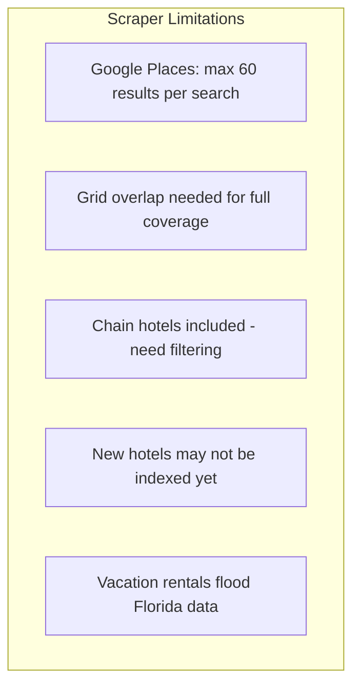
```mermaid
flowchart TB
    subgraph LIMITS["Scraper Limitations"]
        L1["Google Places: max 60 results per search"]
        L2["Grid overlap needed for full coverage"]
        L3["Chain hotels included - need filtering"]
        L4["New hotels may not be indexed yet"]
        L5["Vacation rentals flood Florida data"]
    end
```

---

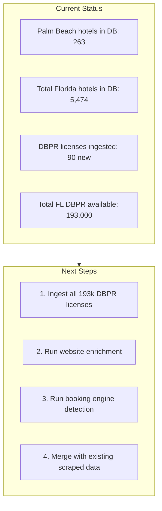
```mermaid
flowchart TB
    subgraph STATUS["Current Status"]
        STAT1["Palm Beach hotels in DB: 263"]
        STAT2["Total Florida hotels in DB: 5,474"]
        STAT3["DBPR licenses ingested: 90 new"]
        STAT4["Total FL DBPR available: 193,000"]
    end

    subgraph NEXT["Next Steps"]
        N1["1. Ingest all 193k DBPR licenses"]
        N2["2. Run website enrichment"]
        N3["3. Run booking engine detection"]
        N4["4. Merge with existing scraped data"]
    end

    STATUS --> NEXT
```
